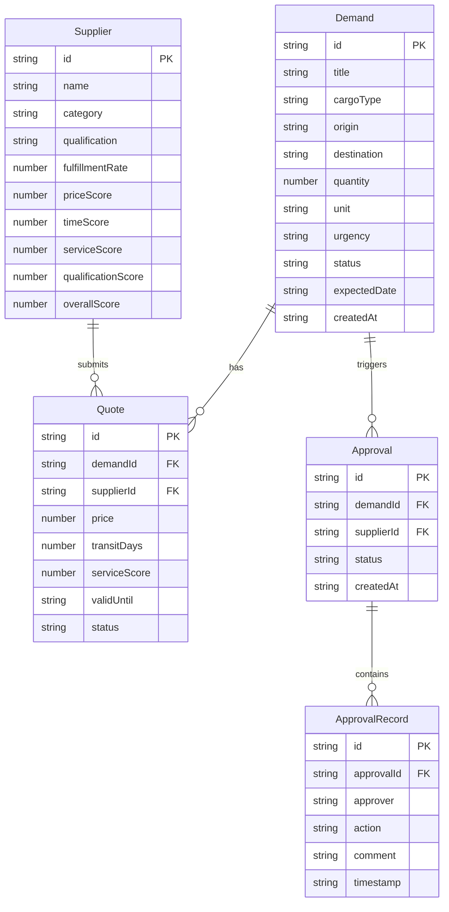

## 1. 架构设计

```mermaid
graph TB
    subgraph "前端层"
        "React App" --> "React Router"
        "React Router" --> "需求池页面"
        "React Router" --> "报价对比页面"
        "React Router" --> "供应商选择页面"
        "React Router" --> "审批状态页面"
        "React Router" --> "数据Mock页面"
    end
    subgraph "数据层"
        "Mock Data Store" --> "需求数据"
        "Mock Data Store" --> "报价数据"
        "Mock Data Store" --> "供应商数据"
        "Mock Data Store" --> "审批数据"
    end
    subgraph "状态管理"
        "Zustand Store" --> "全局状态"
        "Zustand Store" --> "Mock数据管理"
    end
    "需求池页面" --> "Mock Data Store"
    "报价对比页面" --> "Mock Data Store"
    "供应商选择页面" --> "Mock Data Store"
    "审批状态页面" --> "Mock Data Store"
    "数据Mock页面" --> "Zustand Store"
    "Zustand Store" --> "Mock Data Store"
```

## 2. 技术说明

- **前端框架**：React@18 + TypeScript
- **构建工具**：Vite
- **样式方案**：Tailwind CSS@3
- **路由**：React Router@6
- **状态管理**：Zustand
- **图表库**：Recharts（雷达图、条形图）
- **图标**：Lucide React
- **后端**：无，纯前端 Mock 数据
- **数据库**：无，使用内存 Mock 数据 + localStorage 持久化

## 3. 路由定义

| 路由 | 用途 |
|------|------|
| `/` | 重定向到需求池 |
| `/demands` | 需求池页面，展示需求列表及筛选 |
| `/quotes` | 报价对比页面，展示报价对比分析 |
| `/suppliers` | 供应商选择页面，展示供应商评估 |
| `/approvals` | 审批状态页面，展示审批流程 |
| `/mock` | 数据 Mock 管理页面 |

## 4. 数据模型

### 4.1 数据模型定义



### 4.2 Mock 数据策略

- 需求池：12-15 条不同状态的需求
- 供应商：6-8 家供应商，各具不同评分特征
- 报价：每个需求 2-4 个供应商报价
- 审批：5-8 条审批记录，含不同状态
- 数据存储在 Zustand store 中，支持 localStorage 持久化
- Mock 管理页面支持一键重置和数据量调整
